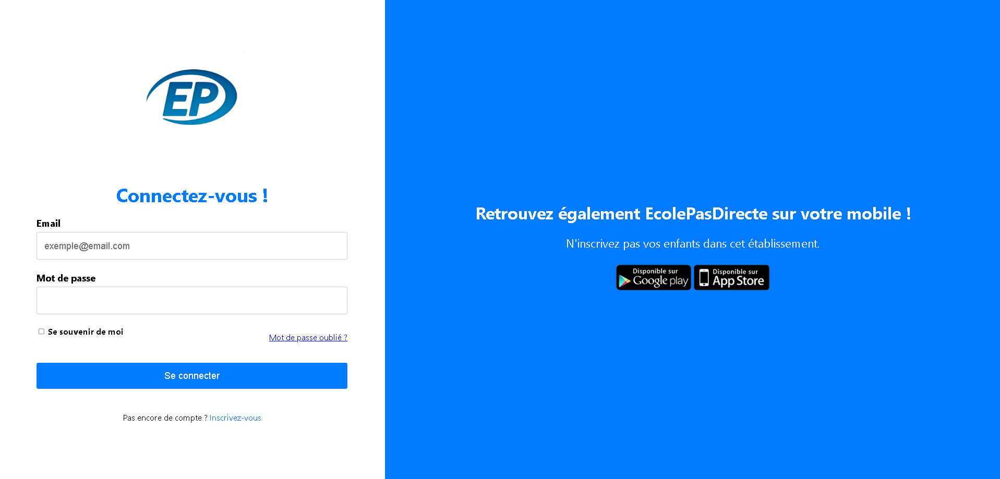

	
	<h1>EcolePasDirecte</h1>
	
<strong>L'ENT qui prend l'école très au sérieux. Enfin, presque.</strong>

	
Un projet web parodique autour de la vie scolaire : connexion, messagerie, votes et autres grandes révolutions de couloir.

	

		<a href="https://brawlcoltdina-oss.github.io/presentationEPD/">Ouvrir le site</a> ·
		<a href="index.html">Version locale</a> ·
		<a href="src/pages/firebase-quick-start.html">Guide Firebase</a>
	

	

> **À propos** — EcolePasDirecte est un projet étudiant humoristique, inspiré des espaces numériques scolaires. Il ne s'agit pas d'un service officiel d'établissement, et ses textes parodiques ne doivent pas être pris pour des informations scolaires réelles.

## Le projet

Un site qui emprunte les codes d'un ENT pour les détourner avec affection : une page de connexion, des espaces de messagerie et de vote, ainsi que des idées pédagogiques qui ont parfois pris un peu trop de liberté.

Le projet a commencé par le site web en classe de seconde. Ce dépôt rassemble des étapes de développement réalisées au fil des années scolaires, ainsi que des pages de documentation consacrées à Firebase.

## Dans le dépôt

| Espace | Ce qu'on y trouve |
| --- | --- |
| `index.html` et `home.html` | Entrée du site et espace d'accueil |
| `src/pages/messages.html` | Messagerie du site |
| `src/pages/vote.html` | Espace de vote |
| `src/pages/firebase-*.html` | Guides, vérifications et pages de configuration Firebase |

## Répartition des rôles

| Contributeur | Domaine principal |
| --- | --- |
| **Johan** | Développement et évolution du site web |
| **Alexandre** | Conception et développement de l'application mobile |

## Chronique du projet

### Jalons consignés

Les entrées ci-dessous reprennent l'historique fourni avec le projet ; elles sont reformulées pour être plus lisibles.

| Date | Contribution |
| --- | --- |
| 15 septembre 2025 | **Alexandre** — Lancement du travail sur l'application mobile : recherche, analyse du fonctionnement et premiers développements. |
| 18 septembre 2025 | **Alexandre** — Première avancée sur l'écran de connexion mobile. |
| 20 septembre 2025 | **Alexandre** — Développement du menu d'accueil de l'application. |
| 22 septembre 2025 | **Alexandre** — Début du système de connexion par identifiant et mot de passe. **Johan** — Correction d'une erreur dans `index.html` et vérification de `validProfiles`. |
| 16 janvier 2026 | **Johan** — Enrichissement du vocabulaire de l'IA parodique, mise à jour du dépôt et premiers essais de mise en ligne et de messagerie. **Alexandre** — Amélioration du menu d'accueil mobile. |
| 27 janvier 2026 | **Johan** — Préparation des pages Firebase et création d'une messagerie web s'appuyant sur les comptes existants ; une version ultérieure devait élargir les comptes et améliorer l'interface. **Alexandre** — Intégration de Firebase Authentication à la connexion de l'application mobile. |
| 29 janvier 2026 | **Johan** — Premières versions de la messagerie et du vote, et évolution de la connexion. |
| 2 février 2026 | **Alexandre** — Vérifications de la base de données et recherche d'une solution d'hébergement local sur Raspberry Pi 5. |

### Journal parallèle — fiction

**Les entrées de cette section sont inventées pour le ton du README. Elles ne décrivent pas des travaux réellement réalisés ni des résultats vérifiés.** Les dates sont choisies pour cette mise en scène.

| Date | Avancée imaginaire |
| --- | --- |
| 14 mars 2026 | **Johan** — Le bouton « Actualiser » est promu au rang de fonctionnalité stratégique après trois clics consécutifs. |
| 2 avril 2026 | **Alexandre** — L'application mobile reçoit un mode « contrôle surprise » : il affiche une notification dramatique, puis se rappelle qu'il n'a pas encore de calendrier. |
| 19 mai 2026 | **Johan** — L'IA prof passe avec succès le test du sarcasme. Échec au test « répondre simplement à la question ». |
| 7 juin 2026 | **Alexandre** — Prototype d'un tableau de bord prédictif : il annonce les devoirs oubliés avec une précision de 100 % lorsqu'ils sont déjà en retard. |
| 23 juillet 2026 | **Johan** — La messagerie atteint la version légendaire V12. Le numéro de version est désormais plus stable que le code. |
| 11 août 2026 | **Alexandre** — Ajout conceptuel d'un mode hors ligne, capable de fonctionner même lorsque le téléphone est posé face contre table. |
| 16 septembre 2026 | **Johan** — Mise en place d'un système de sauvegarde automatique des excuses : « Je l'avais pourtant envoyé » devient enfin consultable. |
| 6 octobre 2026 | **Alexandre & Johan** — Lancement fictif d'EcolePasDirecte 2.0 : mêmes ambitions, davantage de boutons, et une IA qui promet de ne pas noter les utilisateurs. |

## Lancer le projet

Le site est composé de pages HTML, CSS et JavaScript. Pour une première découverte, ouvrez [`index.html`](index.html) ou consultez le [guide de démarrage Firebase](src/pages/firebase-quick-start.html). Vérifiez la configuration avant tout déploiement ou connexion à un vrai projet Firebase.

## Esprit du projet

EcolePasDirecte est un terrain d'expérimentation et une parodie. Les fonctionnalités, données, notes et textes humoristiques ne constituent ni un dossier scolaire ni une source officielle. Les entrées marquées **fiction** ci-dessus sont volontairement inventées.